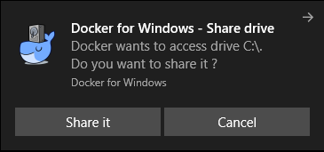
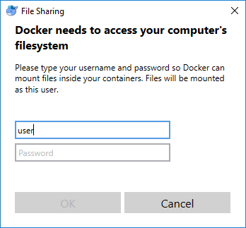

# Install

What works (has been tested):

  - _Linux_: headful/headless play, 1v1 (bot, human), VNC
  - Bot type: `AI_MODULE`, `EXE`, `JAVA_JNI`, `JAVA_MIRROR`
  - [Tested on all SSCAIT 2017 tournament bots (and works on most)](tested_bots.md)

Table of contents:

  * [Ubuntu](#ubuntu)
  * [Windows](#windows)
  * [Mac](#mac)

Docker version used to build the images is `17.09.0-ce`

Currently supports only `Python >= 3.6`, but Py2/3 support is planned soon.

## Ubuntu

### Docker

Based on https://docs.docker.com/engine/installation/linux/docker-ce/ubuntu/

Copy-paste script into terminal:

    sudo apt-get update
    sudo apt-get install -y apt-transport-https ca-certificates curl software-properties-common
    # add docker repository
    curl -fsSL https://download.docker.com/linux/ubuntu/gpg | sudo apt-key add -
    sudo add-apt-repository "deb [arch=amd64] https://download.docker.com/linux/ubuntu $(lsb_release -cs) stable"
    # install docker
    sudo apt-get update
    sudo apt install -y docker-ce=17.09.0~ce-0~ubuntu
    # Make sure you can run docker without sudo
    # (based on https://docs.docker.com/engine/installation/linux/linux-postinstall/#manage-docker-as-a-non-root-user)
    sudo usermod -aG docker $USER
    # Log out and log back in so that your group membership is re-evaluated
    # (close and open terminal window).
    # Someone had to restart their entire machine, but that should not be necessary.

Test to check install was successful:

    docker run hello-world

Now build the images required to run sc-docker. Enter the docker directory and run `build_images.sh`. Now you're setup to install scbw to manage the game containers.

You can manually [download docker of specified version](https://download.docker.com) if it is missing from list of packages. For example

- [Ubuntu 17.04 Zesty 64-bit `docker-ce` package](https://download.docker.com/linux/ubuntu/dists/zesty/pool/stable/amd64/docker-ce_17.09.0~ce-0~ubuntu_amd64.deb)

### Python & pip

(use `python3.6` instead of just `python`)

Lazy version with a lot of sudo (based on [this](http://ubuntuhandbook.org/index.php/2017/07/install-python-3-6-1-in-ubuntu-16-04-lts/))

    sudo add-apt-repository ppa:jonathonf/python-3.6
    sudo apt-get update
    sudo apt-get install -y python3.6
    curl https://bootstrap.pypa.io/get-pip.py | sudo python3.6
    sudo pip3.6 install scbw
    scbw.play --install

### VNC

Install [RealVNC viewer](https://www.realvnc.com ) for viewing GUI headful modes from the docker images.

Save the executable in PATH so that it can be launched as `vnc-viewer`

Something like

    sudo ln -s [where-you-put-vnc] /usr/bin/vnc-viewer

Quick links:

- [download RealVNC](https://www.realvnc.com/en/connect/download/viewer/linux/)

## Windows

### Docker

You may want to [read through manual for installing docker on Windows](https://docs.docker.com/docker-for-windows/install/)
for troubleshooting.

- Go to [docker releases for Windows](https://docs.docker.com/docker-for-windows/release-notes/#docker-community-edition-17090-ce-win32-2017-10-02-stable)
  and download `Docker Community Edition 17.09.0-ce-win33 2017-10-06 (Stable)` ([direct download link](https://download.docker.com/win/stable/13620/Docker%20for%20Windows%20Installer.exe))
- Follow install instructions.

You may need to turn on virtualization support for your CPU (in BIOS).

Test in power shell to check install was successful:

    docker run hello-world

When docker prompt to share disk C, agree on that.

Enter yor credentials:

Sometimes popup for entering your credentials could appear after VNC window, so don't miss it.

Now build the images required to run sc-docker. Enter the docker directory and run `build_images.ps1`. Now you're setup to install scbw to manage the game containers.

### Python & pip

Download and install Python 3.6 release from [Python releases for Windows](https://www.python.org/downloads/windows/)

You might need to [add python / pip to PATH](https://stackoverflow.com/a/4855685).

Install `scbw` package in PowerShell:

    pip install scbw
    scbw.play --install

### VNC
- [download RealVNC](https://www.realvnc.com/en/connect/download/viewer/windows/)

Install, and rename binary to `vnc-viewer`, add the folder with the `vnc-viewer` binary
to `PATH`.

## Mac

### Docker

You may want to [read through manual for installing docker on Mac](https://docs.docker.com/docker-for-mac/install/)
for troubleshooting.

- Go to [docker releases for Mac](https://docs.docker.com/docker-for-mac/release-notes/#docker-community-edition-17090-ce-mac33-2017-10-03-stable)
  and download `Docker Community Edition 17.09.0-ce-mac33 2017-10-03 (Stable)` ([direct download link](https://download.docker.com/mac/stable/19543/Docker.dmg))
- Follow install instructions.

Test in terminal that install was successful:

    docker run hello-world

You might need to add `/Library` folder in `File Sharing` settings.sh

Now build the images required to run sc-docker. Enter the docker directory and run `build_images.sh`. Now you're setup to install scbw to manage the game containers.

### Python & pip

Download and install Python 3.6 release from [Python releases for Mac Os X](https://www.python.org/downloads/mac-osx/)

Install `scbw` package:

    pip3.6 install scbw
    scbw.play --install

### VNC
- [download RealVNC](https://www.realvnc.com/en/connect/download/viewer/macos/)

Create a launcher in `/usr/local/bin/vnc-viewer`:

    #!/bin/sh
    /Applications/VNC \\Viewer.app/Contents/MacOS/vncviewer "$@"

(of course, update path as necessary).
