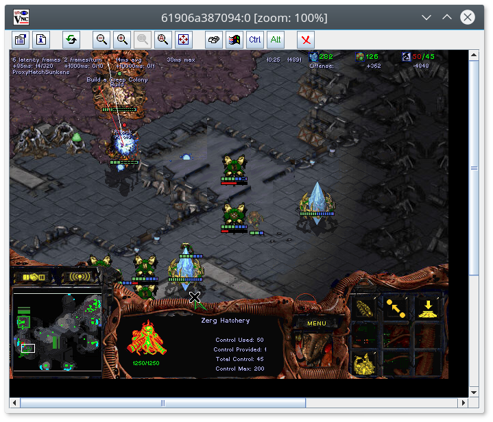

# StarCraft I (BroodWar) docker images

This repository prepares a fully working StarCraft: Brood War
game running in Wine inside of docker image.

It can download and launch bots that use BWAPI to communicate with the game.

## About
We are pleased to publish docker images for StarCraft: Brood War and BW bots!

This means the end of complicated game setup for newcomers or people
who simply want to play StarCraft against AI bots.

You can develop your bots on your favorite platform instead of relying on Windows.

We have more things cooking: This is a part of our ongoing effort to create an easy-to-use environment for machine learning bots (bots that improve based on experience and self-play).

This project is maintained by [Games & Simulations Research Group](http://gas.fel.cvut.cz/)
which is also behind [Student StarCraft AI tournament (SSCAIT)](http://sscaitournament.com).

If you like what we're doing, [support us on Patreon](https://www.patreon.com/sscait). We will be very grateful!

## Installation

See [installation instructions for Linux / Windows / Mac](INSTALL.md).

It should run well on new versions of major operating systems. It was tested on:

- Ubuntu 17.04 Zesty, `Linux 4.10.0-40-generic x86_64`
- Microsoft Windows 10 (64-bit)
- Mac OS Sieria 10.12.6 (64-bit, Mac mini)

Testing and reporting in other settings is very welcome!

## Usage

### Bots playing against each other

Launch headful play of [krasi0](http://sscaitournament.com/index.php?action=botDetails&bot=krasi0) and [CherryPi](https://sscaitournament.com/index.php?action=botDetails&bot=CherryPi) on default map.

    $ scbw.play --bots "krasi0" "CherryPi" --show_all

Create game on the server (VNC viewer on port 5900) and wait for bots to join the game.

### Play against a bot

    $ scbw.play --bots "PurpleWave" --human

Select a map, specify your race, and wait for bot(s) to join the game :)

You can put the RealVNC client to fullscreen and play comfortably.

(Although you might want to change your screen resolution to 800x600)

The GUI is going to be probably slower than normal game due to streaming via VNC.

It is however possible to play the game from the host if you have Windows,
but it is [more complicated setup](USAGE.md#play-on-the-host).

See [more usage examples](USAGE.md).

## Known limitations

- Headful mode needs to specify the map manually due to "Unable to distribute map" bug.
- Works only for BWAPI 3.7.4, 3.7.5, 4.1.2, 4.2.0 and 4.4.0

## Specification

- StarCraft 1.16.1 game from ICCUP (no need for special installs!)
- BWAPI 3.7.4, 3.7.5, 4.1.2, 4.2.0
- BWTA 2.2
- SSCAI maps pack with BWTA/BWTA2 caches
- 32bit oracle Java 8 `1.8.0_152-b16`
- bwheadless `v0.1`
- wine `2.20.0~xenial`
- base image `ubuntu:xenial`
- uses special [tournament module (TM)](github.com/Games-and-Simulations/sc-tm)

## Dockerhub images

Images are available on [Dockerhub](https://hub.docker.com/r/ggaic/starcraft/).

You can use:

    ggaic/starcraft:wine
    ggaic/starcraft:bwapi
    ggaic/starcraft:java
    ggaic/starcraft:play

These are latest stable images and are subject to change.

You can use [stable images with version postfix, which correspond to git tags](https://hub.docker.com/r/ggaic/starcraft/tags/).

## Contributing

Pull requests are welcome! There are still many things to do, especially from [todo list](TODO.md).

## Citations

If you use `sc-docker` in your (academic) work, please cite [our Technical Report](https://arxiv.org/abs/1801.02193):

    @misc{sustr2018multi,
        Author = {Michal \v{S}ustr and Jan Mal\'{y} and Michal \v{C}ertick\'{y}},
        Title = {{Multi-platform Version of StarCraft: Brood War in a Docker Container: Technical Report}},
        Year = {2018},
        Eprint = {arXiv:1801.02193},
    }

## Links

Inspired by

- https://github.com/TorchCraft/TorchCraft/blob/master/docker/no-cuda/Dockerfile
- https://github.com/suchja/x11server/blob/master/Dockerfile
- https://github.com/suchja/wine/blob/master/Dockerfile
- https://hub.docker.com/r/lionax/docker-starcraft/~/dockerfile/

Some useful links

- https://github.com/TorchCraft/TorchCraft/blob/master/docs/user/bwapi_on_linux.md
- https://github.com/TorchCraft/TorchCraft/blob/master/docs/user/installation.md
- https://github.com/tscmoo/bwheadless/releases
- https://github.com/tscmoo/bwheadless/blob/master/main.cpp#L918
