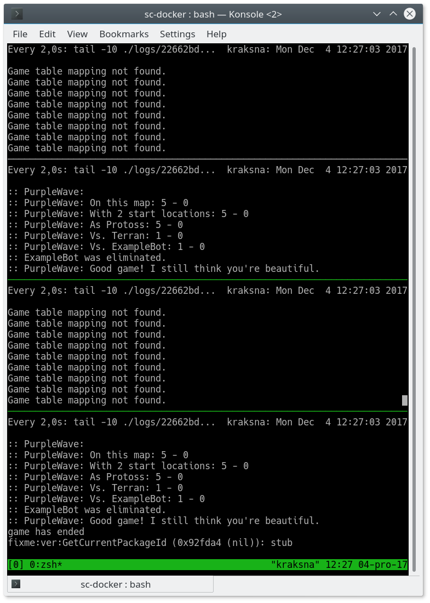

# StarCraft I (BroodWar) docker images

This repository contains fully working StarCraft
game running in Wine inside of docker image.

## About
We are pleased to publish StarCraft I - BroodWar docker images!

This means the end of complicated game setup for newcomers, or people
who would like to simply play SC1 game against some bot.

You can also develop your bots on your favorite platform instead of relying on Windows.

There are still many things to do, and we will be working on improvements.

We have more things cooking: It is a part of our ongoing effor to create environment for reinforcement learning bots
(bots that improve through self-play).

If you'd like to support our effort on Patreon, we would be very grateful!
[link]

## Install

[How to install docker.](https://docs.docker.com/engine/installation/linux/docker-ce/ubuntu/)

## Specification:

It should run on all operating systems (but was tested only on
`Linux 4.10.0-40-generic x86_64` with `Docker version 17.09.0-ce, build afdb6d4`).

There might be problems with docker container networking on Mac/Windows, because
these use virtualization of docker images and has to pass through
special docker gateway.

- StarCraft 1.16.1 game from ICCUP (no need for special installs!)
- BWAPI 4.1.2
- BWTA 2.2
- SSCAI maps pack
- 32bit Java
- bwheadless
- wine 2.20.0~xenial
- base image `ubuntu:xenial`

## Usage

Launch an example play of [PurpleWave](https://github.com/dgant/PurpleWave) (P as Protoss) against Example Bot on default map.

    $ ./run_bots.sh ExampleBot:T PurpleWave:P
    f463e69d-7bbd-4638-a9a4

Let's watch logs to see what is happenning in headless mode.
You will need to have `tmux` installed.

    $ ./watch_logs.sh f46

(you don't need to specify the whole game name, just few chars)

After a moment, PurpleWave should win the game and you'll get similar output to this:

Stop all running docker containers:

    $  docker stop $(docker ps -a -q)

Play against a bot (follow instructions)

    ./play_against_bots.sh PurpleWave:P

### Help

    ./run_bots.sh --help
    ./play_against_bots.sh --help

### Add your own bot

Simply place your java bot to `bots/` directory.

You can see logs from the games in `logs/` directory.

## Dockerhub images

Images are also available on [Dockerhub](https://hub.docker.com/r/ggaic/starcraft/).

You can use:

    ggaic/starcraft:wine
    ggaic/starcraft:bwapi
    ggaic/starcraft:java
    ggaic/starcraft:play

These are development images, and are subject to change.
Stable images have version postfix, and correspond to git tags.

The `run_bots.sh` and `play_against_bots.sh` use docker image `starcraft:play`

## Contributing

PRs are welcome!

Especially from todo list.

### Development

Build images:

    ./build_images.sh

The `run_bots.sh` and `play_against_bots.sh` have special flags `--local`
which will lead to use of local instead of dockerhub images.

## Todo:

- add support for C/C++ bots
- set custom game speed, see how we could integrate bwapi.ini?
- benchmark simulations on top game speed
- add option to launch starcraft game, and bots can connect to it repeatedly
  (save time for repeated plays)
- add some UUID for human games
- add support for singularity containers
- add cached parsed maps: https://github.com/vjurenka/BWMirror/tree/master/bwapi-data/BWTA2
- save replays after game is done into logs folder (or maybe some other one)
- output winner - X vs Y, if Y wins -> output "Y"
- viewing headful via VNC, simplify the process. Maybe use bwapi.ini for hosts?
- sound support (ALSA) :-)

This will go into another repo:

- support "tournament" mode, where a pool of bots can play against each other.
  Calculate ELO ratings.
- Distributed play - pool of workers which will receive info
  about who is to play with whom and they would run the simulation.
  Probably will use RabbitMQ.

## Citation

If you use `sc-docker` in your (academic) work, please cite us:

    @misc{StarcraftDocker,
      title = {Starcraft-I docker images},
      author = "Sustr, Michal and Maly, Jan and Certicky, Michal",
      howpublished = {\url{https://github.com/Games-and-Simulations/sc-docker}},
    }

## Inspired by

- https://github.com/TorchCraft/TorchCraft/blob/master/docker/no-cuda/Dockerfile
- https://github.com/suchja/x11server/blob/master/Dockerfile
- https://github.com/suchja/wine/blob/master/Dockerfile
- https://hub.docker.com/r/lionax/docker-starcraft/~/dockerfile/

## Some useful links

- https://github.com/TorchCraft/TorchCraft/blob/master/docs/user/bwapi_on_linux.md
- https://github.com/TorchCraft/TorchCraft/blob/master/docs/user/installation.md
- https://github.com/tscmoo/bwheadless/releases
- https://github.com/tscmoo/bwheadless/blob/master/main.cpp#L918
